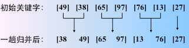
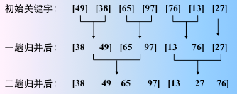
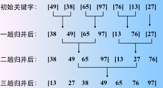

# Algorithmic

### Algorithmic.md文件
一些常见的算法题结题思路等。

### C++目录 
以C++实现的相关题目

* **MinStack**

 题目：设计包含min函数的栈。定义栈的数据结构，要求添加一个min 函数，能够得到栈的最小元素。要求函数min、push 以及pop 的时间复杂度都是O(1)。
 解法：定义栈元素，每个栈元素含有当前的最小值即可。
      解法二，再维护一个最小值栈，每次入栈时，判断当前值如果小于等于 最小值栈顶元素，最小值栈就入栈。出栈时，判断如果等于 最小值栈栈顶元素，最小值栈就出栈。获取最小值时只需要去最小值栈顶元素即可。
      
* **findTreeToListTest**

 题目：输入一棵二元查找树，将该二元查找树转换成一个排序的双向链表。 要求不能创建任何新的结点，只调整指针的指向。

 二元查找树定义：  
  (1)它首先要是一棵二元树(二叉树)，在这基础上它或者是一棵空树，或者是具有下列性质的二元树。  
  (2)若左子树不空，则左子树上所有结点的值均小于它的父结点的值；  
  (3)若右子树不空，则右子树上所有结点的值均大于等于它的根结点的值；  
  (4)左、右子树也分别为二元查找树  

* **GreatestSubArraySum**

 题目:输入一个整形数组，数组里有正数也有负数。 数组中连续的一个或多个整数组成一个子数组，每个子数组都有一个和。 求所有子数组的和的最大值。要求时间复杂度为 O(n)。
 例如输入的数组为 1, -2, 3, 10, -4, 7, 2, -5，和最大的子数组为 3, 10, -4, 7, 2， 因此输出为该子数组的和 18。

### Swift目录 
以Swift实现的相关算法题

* **Heap(堆相关)**

 堆排序是利用堆这种数据结构而设计的一种排序算法，堆排序是一种选择排序，它的最坏，最好，平均时间复杂度均为O(nlogn)，它也是不稳定排序。首先简单了解下堆结构。

 堆是具有以下性质的完全二叉树：每个结点的值都大于或等于其左右孩子结点的值，称为大顶堆；或者每个结点的值都小于或等于其左右孩子结点的值，称为小顶堆。

 
 堆的实现，包含大顶堆，小顶堆的各种操作，堆排序等。

* **mergeSort**

 二路归并排序
 归并类的排序算法

归并：将两个或两个以上的有序表组合成一个新的有序表。
	
内部排序中，通常采用的是 2-路归并排序。即：将两个位置相邻的记录有序子序列归并为一个记录有序的序列。归并排序是建立在归并操作上的一种有效的排序算法。该算法是采用分治法（Divide and Conquer）的一个非常典型的应用。
	
图解如下
	

	
看成是 n 个有序的子序列（长度为 1），然后两两归并。
	

	
得到 n/2 个长度为2 或 1 的有序子序列。继续两两归并
	

	
最后一趟
	

 

* **BuildTree(树的遍历)**

 根据二叉树的前序遍历和中序遍历构建二叉树  
 《多叉树的遍历.md》介绍了多叉树的遍历（深度优先遍历和广度优先遍历）

* **FibonacciSequence**

 斐波那契数列的实现