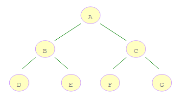

# 树的遍历

一个简单的树结构图




#### 一、深度优先遍历

深度优先遍历指的是，从树的根节点开始，先遍历左子树，然后遍历右子树。

我们借助栈结构来实现深度优先遍历。上图的深度优先遍历结果为：ABDECFG

代码如下：

```
Stack<Node> stack = new Stack<Node>();
List<Node> result = new ArrayList<Node>();
stack.push(root);
while (!stack.isEmpty()) {
	Node top = stack.pop();
	result.add(top);
	List<Node> children = top.getChildren();
	if (children != null && children.size() > 0) {
		for (int i = children.size() - 1; i >= 0; i--) {
			stack.push(children.get(i));
		}
	}
}
```


#### 二、广度优先遍历

从根节点开始，沿着树的宽度依次遍历树的每个节点。

我们借助队列结构来实现树的广度优先遍历。上图的遍历结果为：ABCDEFG

代码如下：

```
Queue<Node> queue = new LinkedBlockingQueue<Node>();
List<Node> result = new ArrayList<Node>();
queue.add(root);
while (!queue.isEmpty()) {
	Node first = queue.poll();
	result.add(first);
	List<Node> children = first.getChildren();
	if (children != null && children.size() > 0) {
		for (int i = 0; i < children.size(); i++) {
			queue.add(children.get(i));
		}
	}
}
```